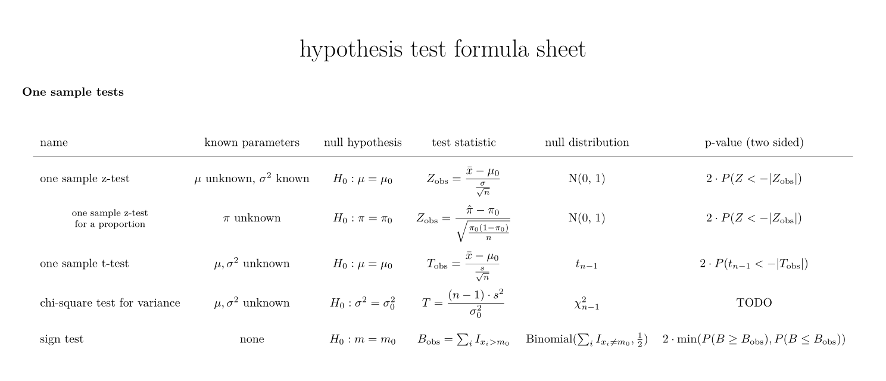
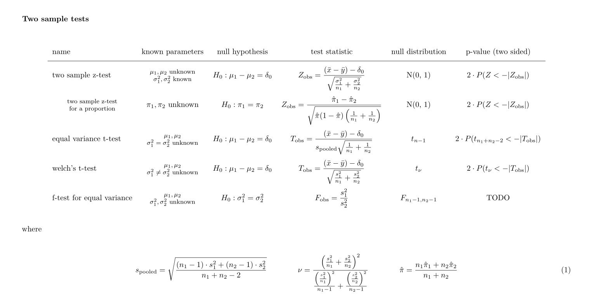

# over-it

<!-- badges: start -->
<!-- badges: end -->

This repository contains a reference sheet `hypothesis-tests-reference.pdf`, which lists formulas you need to know for some classical hypothesis tests, and `intro-to-hypothesis-testing.pdf`, some lecture notes that I use when introducing students to testing for the first time. 

The reference sheet is a work in progress. For a test, here's the section on one-samples tests:

For two samples tests we currently have:

The reference sheet is mostly for my students to use, as the courses I TA don't require a textbook and they spend way too much time looking for these formulas.

Pull requests to add new tests or improve notation and formating are very welcome! Both pdf documents are compiled from the corresponding `*.Rmd` files.

### Caveat

Blasting students with this information is my least favorite way to teach hypothesis testing. If I had my way I would teach only the nonparametric bootstrap, or barring that, I'd follow Jonas Lindeløv's [tests as linear models approach](https://lindeloev.github.io/tests-as-linear/).

## License

The documents in this repo are available under the CC0 license, meaning that I have released them into the public domain and you can do what you want with them. The notable exception is the XKCD comic `figures/significant.png`, which I do not own the rights to.
